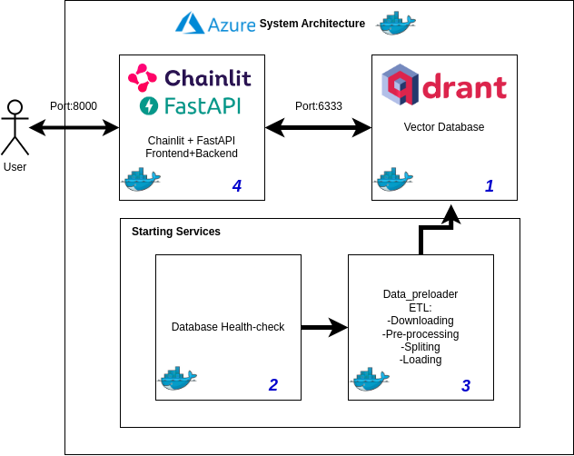
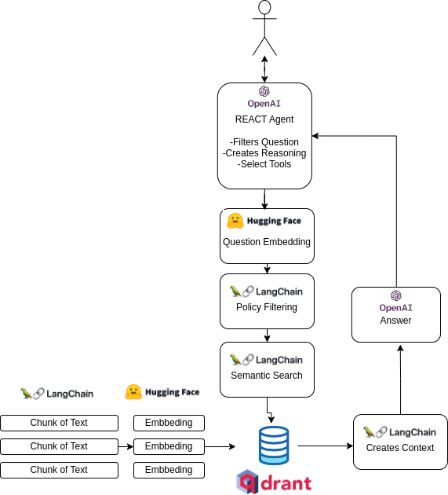

# 🤖 Policy Guru Chatbot 🏦

The Policy Insurance Chatbot is your virtual insurance assistant designed to make your insurance journey smooth and hassle-free! 😊

## Features ✨

- **24/7 Availability**: Our chatbot is always ready to assist you, day or night, weekdays or weekends. 🕰️

- **Policy Information**: Access your policy details, coverage information, and renewal dates with just a few clicks. 🔍📋

## How to Install 📝

Complete stand-alone application
```
docker compose up --build
```
## Modules Documentation :gift:
Let's take a quick overview of each module:

### **app** :computer:

It has all the needed code to implement the front and backend of the chatbot. It uses Chainlit framework for LLMs.

- `app/agent_utils.py`: Includes the required function for the creation of a custom Agent Class and ChatBOT Class.
- `app/app.py`: Includes Chainlit front-end code
- `app/chainlit.md`: Markdown file for Chainlit README
- `app/config.py`: env variables for api configuration .
- `app/data_utils.py`: Includes Database connection and embbedgins loading.
- `app/text_templates.py`: Includes all the custom Prompt Templates.

### **data_preloader** :floppy_disk:

Microservice forQdrant database initialization. 

-   `dataset/`: Predefined folder to store dowloaded and processed PDFs. This folder is shared with APP microservice in the `docker-compose.yml`: file to allow the user to download the PDFs.
-   `config.py`: env variables for api configuration .
- `data_utils.py` Functions to download the Data from S3.
- `document_utils.py` Preprocessing/Cleaning and Qdrant loading functions.
- `health_check.py` ENTRYPOINT for healtcheck microservice. Checks if Qdrant is ready to receive querys to avoid building errors.
- `main.py` ENTRYPOINT for preloader microservice. Downloads, procceses and saves the data in Qdrant.
- `text_preprocessing.py` Text normalization and preprocessing functions.

### **qdrant_db** :mag_right:

Shared volume with Qdrant docker container. Saves all the embbegins information. Check the [documentation](https://qdrant.tech/).

## **System's Diagram** 

You can also take a look at the file `images/System_architecture_diagram.drawio.png` to have a graphical description of the microservices and how the communication is performed.



## **Workflow**

Code workflow 



## Folders architecture

```ut8
├── app
│   ├── agent_utils.py
│   ├── app.py
│   ├── chainlit.md
│   ├── config.py
│   ├── data_preloader
│   │   └── dataset
│   │       ├── raw_chunks
│   │       └── raw_pdfs
│   ├── data_utils.py
│   ├── Dockerfile
│   ├── __init__.py
│   ├── requirements.txt
│   └── text_templates.py
├── data_preloader
│   ├── config.py
│   ├── dataset
│   │   ├── raw_chunks
│   │   └── raw_pdfs
│   ├── data_utils.py
│   ├── Dockerfile
│   ├── document_utils.py
│   ├── health_check.py
│   ├── __init__.py
│   ├── main.py
│   ├── requirements.txt
│   └── text_preprocessing.py
├── dataset
│   ├── raw_chunks
│   └── raw_pdfs
├── docker-compose.yml
├── EDA.ipynb
├── env_template
├── images
├── LICENSE
├── qdrant_db
│   └── qdrant_storage
├── README.md
├── tests
    └── __init__.py

```
## Feedback 📢

We value your feedback and suggestions! If you have any ideas for improvement or encounter any issues, please let us know. 🙌📧

## Disclaimer 📜

The Policy Insurance Chatbot is designed to provide general insurance information and quotes. For specific policy details and personalized advice, we recommend consulting with our professional insurance agents. 👨‍💼🔍

Let's get started and simplify your insurance journey! 🚀💼


## Code Style


We use [Black](https://black.readthedocs.io/) and [isort](https://pycqa.github.io/isort/) for automated code formatting in this project, you can run it with:

```console
$ isort --profile=black . && black --line-length 88 .
```

Wanna read more about Python code style and good practices? Please see:
- [The Hitchhiker’s Guide to Python: Code Style](https://docs.python-guide.org/writing/style/)
- [Google Python Style Guide](https://google.github.io/styleguide/pyguide.html)